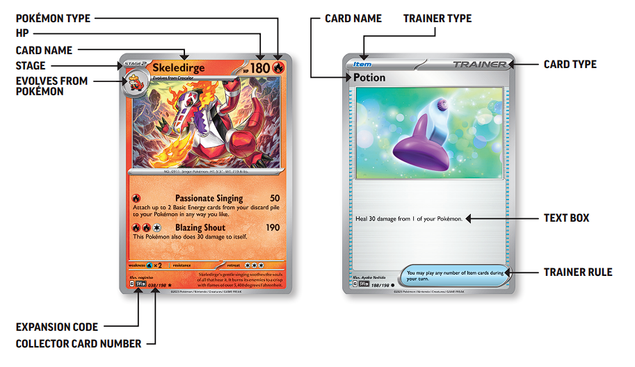

# ポケカ英語

## 基本用語

### フィールド

| 日本語 | 英語 | 英語の発音（カタカナ） |
| --- | --- | --- |
| 対戦 | Match | マッチ |
| 対戦相手 | Opponent | オポーネント |
| 山札 | Deck | デック |
| 手札 | Hand | ハンド |
| トラッシュ | Discard / Discard Pile | ディスカード / ディスカード パイル |
| 場 | Field | フィールド |
| バトル場 | Active Spot | アクティブ スポット |
| ベンチ | Bench | ベンチ |
| サイド | Prize | プライズ |

### タイプ

| 日本語 | 英語 | 英語の読み方（カタカナ） |
| --- | --- | --- |
| 草 | Grass | グラス |
| 炎 | Fire | ファイア |
| 水 | Water | ウォーター |
| 雷 | Lightning | ライトニング |
| 闘 | Fighting | ファイティング |
| 超 | Psychic | サイキック |
| 悪 | Darkness | ダークネス |
| 鋼 | Metal | メタル |
| ドラゴン | Dragon | ドラゴン |
| 無色 | Colorless | カラーレス |

### カードの要素

| 日本語 | 英語 | 英語の発音（カタカナ） |
| --- | --- | --- |
| ポケモン | Pokémon | ポケモン |
| たねポケモン | Basic Pokémon | ベーシック ポケモン |
| 1進化ポケモン | Stage 1 Pokémon | ステージ 1 ポケモン |
| 2進化ポケモン | Stage 2 Pokémon | ステージ 2 ポケモン |
| ルールをもつポケモン | Pokémon with Rule Box | ポケモン ウィズ ルール ボックス |
| ワザ | Attack | アタック |
| 特性 | Ability | アビリティ |
| 弱点 | Weakness | ウィークネス |
| 抵抗力 | Resistance | レジスタンス |
| にげる | Retreat | リトゥリート |
| にげエネ | Retreat Cost | リトゥリート コスト |
| どく | Poisoned | ポイズンド |
| やけど | Burned | バーンド |
| ねむり | Asleep | アスリープ |
| こんらん | Confused | コンフューズド |
| まひ | Paralysed | パラライズド |
| エネルギー | Energy | エナジー |
| サポート | Supporter | サポーター |
| グッズ | Item | アイテム |
| ポケモンのどうぐ | Tool / Pokémon Tool | ツール / ポケモン ツール |
| スタジアム | Stadium | ステディアム |
| 「古代」ポケモン | Ancient Pokémon | エンシェント ポケモン |
| 「未来」ポケモン | Future Pokémon | フューチャー ポケモン |

## 対戦前のあいさつ

| 日本語 | 英語 | 英語の発音（カタカナ） |
| --- | --- | --- |
| はじめまして | Nice to meet you. | ナイス トゥ ミート ユー |
| 私は[名前]です | I'm [Name]. / My name is [Name]. | アイム [名前] / マイ ネーム イズ [名前] |
| あなたは[名前]ですか？ | Are you [Name]? | アー ユウ [名前] |

## 対戦前の流れ

| 日本語 | 英語 | 英語の発音（カタカナ） |
| --- | --- | --- |
| シャッフルをしてもらえますか？　| Could you shuffle my deck? | クッド ユウ シャッフル マイ デック |
| 先攻・後攻を決めましょう | Let's decide who goes first. | レッツ ディサイド フー ゴーズ ファースト |
| ダイスを振ります | Let's roll dice. Heads or Tails ? | レッツ ロール ダイス ヘッズ オア テイルズ |
| 先攻（後攻）を取ります | I will go first (second). | アイル ゴー ファースト (セカンド) |

## 対戦準備

| 日本語 | 英語 | 英語の発音（カタカナ） |
| --- | --- | --- |
| たねポケモンがあります | I have Basic Pokémon. | アイ ハヴ ベーシック ポケモン |
| たねポケモンがありません | I don't have Basic Pokémon. / No basic. | アイ ドント ハヴ ベーシック ポケモン / ノー ベーシック |
| たねポケモンを出します | I will put Basic Pokémon. | アイル プット ベーシック ポケモン |
| サイドを置きます | I will place Prize cards. | アイル プレイス プライズ カーズ |
| (マリガン時に) 手札を公開します | I will show my hand. | アイル ショウ マイ ハンド |
| (マリガン分の) カードをX枚引きます | I will draw X cards for mulligan. | アイル ドロー X カーズ フォー マリガン |
| 対戦よろしくお願いします | Let's have a good match! / Good luck! | レッツ ハヴァ グッド マッチ / グッド ラック |

## 自分のターンの流れ（展開）

| 日本語 | 英語 | 英語の発音（カタカナ） |
| --- | --- | --- |
| (ターンの最初に) ドローします | Draw for turn. | ドロー フォー ターン |
| 山札からカードをX枚引きます | I will draw X cards. | アイル ドロー X カーズ |
| サポートを使います | I will play a supporter. | アイル プレイ ア サポーター |
| グッズを使います | I will play an item. | アイル プレイ ア アイテム |
| スタジアムを使います | I will play a stadium. | アイル プレイ ア ステディアム |
| (このターンのエネルギーを) 手張りします | I will attach for turn. | アイル アタッチ フォー ターン |
| エネルギーをつけます | Attach an energy to [Pokémon Name]. | アイル アタッチ アン エナジー / アタッチ アン エナジー トゥ [ポケモン] |
| ポケモンのどうぐをつけます | I will attach a Pokémon Tool. | アイル アタッチ ア ポケモン ツール |
| 山札から探します | I will search my deck. | アイル サーチ マイ デック |
| 〇〇を手札に加えます | I will add [Card Name] to my hand. | アイル アッド [カード名] トゥ マイ ハンド |
| 対象はありません | There is no target. | ゼア イズ ノー ターゲット |
| まだ山札をさわります（まだカットしなくていいですという意味）| I'm going to go back in. | アイム ゴーイング トゥ ゴー バック イン |
| 進化します | I will evolve to [Pokémon Name]. | アイル エヴォルブ トゥ [進化ポケモン] |
| ポケモンをベンチに出します | I will put [Pokémon Name] on the Bench. | アイル プット [ポケモン] オン ザ ベンチ |
| ポケモンを入れ替えます | I will switch [Pokémon Name]. | アイル スイッチ [ポケモン] |
| ポケモンを逃がします | I will retreat. | アイル リトリート |
| 特性を使います | I will use the ability [Ability Name]. | アイル ユーズ ザ アビリティ [アビリティ] |
| カットをお願いします | Please cut my deck. | プリーズ カット マイ デック |
| カットしますか？ | Would you like to cut my deck / hand? | ウデュゥ ユウ ライク トゥ カット マイ デック / ハンド |
| 手札は何枚ですか？ | How many cards do you have in your hand? / What hand size? | ハウ メニー カーズ ドゥ ユウ ハヴ イン ユア ハンド / ワット ハンド サイズ |
| (相手のカードを) 確認してもいいですか？ | Can I check/read this? | キャナイ チェック/リード ディス |
| トラッシュを見てもいいですか？ | Can I check/look your discard, please? | キャナイ チェック/ルック ユア ディスカード プリーズ |
| 少し考えます | I will think for a moment. | アイル シンク フォー ア モーメント |

> [!NOTE]
> カード・特性・ワザの名前を知らなくても、カードを指さして「this」や「that」と言えば、相手は理解できる

## 自分のターンの流れ（ワザ）

| 日本語 | 英語 | 英語の発音（カタカナ） |
| --- | --- | --- |
| ワザを使ってXダメージを与えます | I will use the attack [Attack Name] for X damage. | アイル ユーズ ザ アタック [ワザ] フォー X ダメージ |
| ベンチのポケモンのダメージはX点です | The damage on the Bench Pokémon is X. | ザ ダメージ オン ザ ベンチ ポケモン イズ X |
| （複数対象のワザの場合で）X点とY点ダメージを与えます | X to [Pokémon Name], Y to [Pokémon Name]. | X トゥ [ポケモン], Y トゥ [ポケモン] |
| ワザの効果でダメカンを置きます | I will put damage counters with the effect of [Attack Name]. | アイル プット ダメージ カウンターズ ウィズ ザ エフェクト オブ [ワザ] |
| 倒します | Knock out. | ノック アウト |
| ベンチにダメカンをX個置きます | I will put X damage counters on the Bench. | アイル プット X ダメージ カウンターズ オン ザ ベンチ |
| 特性の効果でダメカンをX点乗せ換えます | I will move X damage counters with the effect of [Ability Name]. | アイル ムーブ X ダメージ カウンターズ ウィズ ザ エフェクト オブ [アビリティ] |
| ワザの効果でエネルギーをつけます | I will attach energy with the effect of [Attack Name]. | アイル アタッチ エナジー ウィズ ザ エフェクト オブ [ワザ] |
| ワザの効果でカードをX枚引きます | I will draw X cards with the effect of [Attack Name]. | アイル ドロー X カーズ ウィズ ザ エフェクト オブ [ワザ] |
| ワザの効果でポケモンを どく/やけど/こんらん/ねむり/まひ にします | I will poison/burn/confuse/sleep/paralyse with the effect of [Attack Name]. | アイル ポイズン / バーン / コンフューズ / スリープ / パラライズ ウィズ ザ エフェクト オブ [ワザ] |
| ダメカンを取り除きます | I will remove damage counters. | アイル リムーブ ダメージ カウンターズ |
| サイドをX枚取ります | I will take X prize cards. | アイル テイク X プライズ カーズ |
| 番を終わります | I will pass. / Your turn. | アイル パス / ユア ターン |

## ポケモンチェック

| 日本語 | 英語 | 英語の発音（カタカナ） |
| --- | --- | --- |
| 毒のダメージでX点のダメージを乗せます | I will put X damage counters for poison. | アイル プット X ダメージ カウンターズ フォー ポイズン |
| やけどのダメージでX点のダメージを乗せます | I will put X damage counters for burn. | アイル プット X ダメージ カウンターズ フォー バーン |
| 特性の効果でダメカンを置きます | I will put damage counters with the effect of [Ability Name]. | アイル プット ダメージ カウンターズ ウィズ ザ エフェクト オブ [アビリティ] |
| ねむりの状態なのでダイスを振ります | I will roll dice for asleep. | アイル ロール ダイス フォー アスリープ |
| まひから回復します | I will recover from paralysed. | アイル リカバー フロム パラライズド |

## 相手のターン

| 日本語 | 英語 | 英語の発音（カタカナ） |
| --- | --- | --- |
| どうぞ | Here you are. / Please go ahead. | ヒア ユー アー / プリーズ ゴー アヘッド |
| 何ダメージですか？ | How much damage is it? | ハウ マッチ ダメージ イズ イット |
| トラッシュに〇〇のカードは何枚ありますか？ | How many XXX cards do you have in your discard pile? | ハウ メニー [XXX] カーズ ドゥ ユー ハヴ イン ユア ディスカード パイル |
| デッキをカットしてもいいですか？ | Could I cut your deck? | クッド アイ カット ユア デック |
| このターンはすでにサポートを使っています | You have already played a supporter this turn. | ユー ハヴ アルレディ プレイド ア サポーター ディス ターン |
| このターンはすでにエネルギーを貼っています | You have already attached an energy this turn. | ユー ハヴ アルレディ アタッチド アン エナジー ディス ターン |
| このターンはすでに "にげる" を行っています | Your Pokémon have already retreated this turn. | ユア ポケモン ハヴ アルレディ リトゥリーテッド ディス ターン |
| このポケモンはこのターンに場に出たため、進化できません | This Pokémon cannot evolve this turn because it was just put on the field. | ディス ポケモン キャント エヴォルヴ ディス ターン ビコーズ イット ワズ ジャスト プット オン ザ フィールド |
| 少し早くプレイしてもらえますか？ | Would you play a little faster? | ウデュゥ ユウ プレイ ア リトル ファスター |
| 早くプレイしないなら、ジャッジを呼びますよ | If you don't play faster, I will have to call a judge. | イフ ユー ドント プレイ ファスター, アイル ハヴ トゥ コール ア ジャッジ |

## ジャッジに相談する

| 日本語 | 英語 | 英語の発音（カタカナ） |
| --- | --- | --- |
| ジャッジを呼ぶ | Judge! | ジャッジ |
| 日本語の通訳をお願いします | Please call a Japanese translator. | プリーズ コール ア ジャパニーズ トランスレーター |
| 落ちたカードを拾ってください | Please pick up the dropped card. | プリーズ ピック アップ ザ ドロップド カード |
| 間違えてサポートを2回使っていました | He used a supporter twice by mistake. | ヒー ユーズド ア サポーター トワイス バイ ミステイク |
| 間違えて山札を見ていました | He looked at his deck by mistake. | ヒー ルックド アット ヒズ デック バイ ミステイク |
| 2枚のカードしか引けないのに3枚引きました | He drew 3 cards by mistake, but he can only draw 2. | ヒー ドロー 3 カーズ バイ ミステイク, バット ヒー キャン オンリー ドロー 2 |
| 間違えてサイドから2枚取っていました | He took 2 prize cards by mistake. | ヒー トゥック 2 プライズ カーズ バイ ミステイク |
| 場に出したばかりのポケモンを進化させました | He evolved the Pokémon by mistake. It was just put on the field. | ヒー エヴォルヴド ザ ポケモン バイ ミステイク. イット ワズ ジャスト プット オン ザ フィールド |
| トラッシュから手札にカードを戻していました | He put a card from his discard pile to his hand. | ヒー プット ア カード フロム ヒズ ディスカード パイル トゥ ヒズ ハンド |
| 彼のプレイは正しくないと思います | I think his play is incorrect. | アイ シンク ヒズ プレイ イズ インコレクト |
| 残り何分ですか？ | How many minutes are left in the match? | ハウ メニー ミニッツ アー レフト イン ザ マッチ |
| 追加時間をもらえますか？ | Could we have some extra time? | クッド ウィー ハヴ サム エクストラ タイム |

## 対戦後の流れ

| 日本語 | 英語 | 英語の読み方（カタカナ） |
| --- | --- | --- |
| 投了します | I will concede. / Scoop. | アイ ウィル コンシード / スクープ |
| 次のゲームへ | Next game. | ネクスト ゲーム |
| 後攻（先攻）をもらいます | I will take second (first). | アイル テイク セカンド (ファースト) |
| いい試合でした | It was a good match. | イット ワズ ア グッド マッチ |
| 上手でした | You played very well. | ユー プレイド ベリー ウェル |
| なんとか勝てました | I closed it out. | アイ クローズド イット アウト |
| とても楽しかったです | I had a lot of fun. | アイ ハド ア ロット オブ ファン |
| 対戦ありがとうございました | Good game. / GG / Thank you for the match. | グッド ゲーム / ジージー / サンキュー フォー ザ マッチ |
| 次もがんばってください | Good luck next time! | グッド ラック ネクスト タイム |

## 汎用カード

### グッズ

| 日本語 | 英語 | 英語の発音（カタカナ） |
| --- | --- | --- |
| ネストボール | Nest Ball | ネスト ボール |
| ハイパーボール | Ultra Ball | ウルトラ ボール |
| なかよしポフィン | Buddy-Buddy Poffin | バディ バディ ポフィン |
| エネルギー転送 | Energy Search | エナジー サーチ |
| ポケギア3.0 | Pokégear 3.0 | ポケギア 3.0 |
| 大地の器 | Earthen Vessel | アースン ベッセル |
| エレキジェネレータ | Electric Generator | エレクトリック ジェネレーター |
| ガラスのラッパ | Glass Trumpet | グラス トランペット |
| ポケモンいれかえ | Switch | スイッチ |
| ともだちてちょう | Pal Pad | パル パッド |
| エネルギー回収 | Energy Retrieval | エナジー リトリーバル |
| 夜のタンカ | Night Stretcher | ナイト ストレッチャー |
| クラッシュハンマー | Crushing Hammer | クラッシング ハンマー |
| ポケモンキャッチャー | Pokémon Catcher | ポケモン キャッチャー |
| カウンターキャッチャー | Counter Catcher | カウンター キャッチャー |
| プライムキャッチャー | Prime Catcher | プライム キャッチャー |
| アンフェアスタンプ | Unfair Stamp | アンフェア スタンプ |
| ツールスクラッパー | Tool Scrapper | ツール スクラッパー |
| ふしぎなアメ | Rare Candy | レア キャンディ |
| エネルギーつけかえ | Energy Switch | エナジー スイッチ |

### ポケモンのどうぐ

| 日本語 | 英語 | 英語の発音（カタカナ） |
| --- | --- | --- |
| まけんきハチマキ | Defiance Band | ディファイアンス バンド |
| げんきのハチマキ | Vitality Band | バイタリティ バンド |
| ブーストエナジー古代 | Ancient Booster Energy Capsule | エンシェント ブースター エナジー カプセル |
| ブーストエナジー未来 | Future Booster Energy Capsule | フューチャー ブースター エナジー カプセル |
| ブレイブバングル | Brave Bangle | ブレイブ バングル |
| 勇気のおまもり | Bravery Charm | ブレイバリー チャーム |
| ヒーローマント | Hero's Cape | ヒーローズ ケープ |
| ハンディーサーキュレーター | Handheld Fan | ハンドヘルド ファン |
| 重力玉 | Gravity Gemstone | グラビティ ジェムストーン |
| ワザマシン エヴォリューション | Technical Machine Evolution | テクニカル マシン エヴォリューション |
| ワザマシン デヴォリューション | Technical Machine Devolution | テクニカル マシン デヴォリューション |
| 緊急ボード | Rescue Board | レスキュー ボード |
| ふうせん | Air Balloon | エアー バルーン |
| 学習装置 | Exp. Share | エクスピアリエンス シェア |

### サポート

| 日本語 | 英語 | 英語の読み方（カタカナ） |
| --- | --- | --- | 
| 博士の研究 | Professor's Research | プロフェッサーズ リサーチ |
| ナンジャモ | Iono | アイオノ |
| ジャッジマン | Judge | ジャッジ |
| ゼイユ | Carmine | カーマイン |
| ペパー | Arven | アーヴェン |
| アクロマの執念 | Corless's Tenacity | コルレスズ テナシティ |
| シアノ | Cyrano | シアノ |
| タケシのスカウト | Brock's Scouting | ブロックズ スカウティング |
| トウコ | Hilda | ヒルダ |
| オーリム博士の気迫 | Professor Sada's Vitality | プロフェッサー サダズ バイタリティ |
| アカマツ | Crispin | クリスピン |
| ボタン | Penny | ペニー |
| フトゥー博士のシナリオ | Professor Turo's Scenario | プロフェッサー トゥーロズ シナリオ |
| ボスの指令 | Boss's Orders | ボスズ オーダーズ |
| ビワ | Eri | エリ |
| クセロシキのたくらみ | Xerosic's Machinations | ゼロシキズ マキネーションズ |
| スグリ | Kieran | キーラン |
| ブライア | Briar | ブライア |

### スタジアム

| 日本語 | 英語 | 英語の発音（カタカナ） |
| --- | --- | --- |
| ボウルタウン | Artazon | アルタゾン |
| タウンデパート | Town Store | タウン ストア |
| ポケモンリーグ本部 | Pokémon League Headquarters | ポケモン リーグ ヘッドクォーターズ |
| ジャミングタワー | Jamming Tower | ジャミング タワー |
| ニュートラルセンター | Neutral Center | ニュートラル センター |
| 夜のアカデミー | Night Academy | ナイト アカデミー |
| 偉大な大樹 | Grand Tree | グランド ツリー |
| ゼロの大空洞 | Area Zero Underdepths | エリア ゼロ アンダーデプス |
| グラビティーマウンテン | Gravity Mountain | グラビティー マウンテン |
| スパイクタウンジム | Spikemuth Gym | スパイクマス ジム |
| ロケット団の監視塔 | Team Rocket's Watchtower | チーム ロケッツ ウォッチタワー |

#### エネルギー

| 日本語 | 英語 | 英語の読み方（カタカナ） |
| --- | --- | --- |
| ルミナスエネルギー | Luminous Energy | ルミナス エナジー |
| リバーサルエネルギー | Reversal Energy | リバーサル エナジー |
| ミストエネルギー | Mist Energy | ミスト エナジー |
| ネオアッパーエネルギー | Neo Upper Energy | ネオ アッパー エナジー |
| レガシーエネルギー | Legacy Energy | レガシー エナジー |
| イグニッションエネルギー | Ignition Energy | イグニッション エナジー |
| プリズムエネルギー | Prism Energy | プリズム エナジー |

### システムポケモン

| 日本語 | 英語 | 英語の発音（カタカナ） |
| --- | --- | --- |
| シェイミ | Shaymin | シェイミ |
| シャリタツ | Tatsugiri | タツギリ |
| スボミー | Budew | バデュー |
| ピィ | Cleffa | クレファ |
| クレッフィ | Klefki | クレフキ |
| マシマシラ | Munkidori | マンキドリ |
| テツノツツミ | Iron Bundle | アイアン バンドル |
| ホーホー | Hoothoot | フートゥート |
| ヨルノズク | Noctowl | ノクトウル |
| ヨワマル | Duskull | ダスカル |
| サマヨール | Dusclops | ダスクロップス |
| ヨノワール | Dusknoir | ダスクノア |
| イキリンコex | Squawkabilly ex | スクワカビリー イーエックス |
| キチキギスex | Fezandipiti | フェザンディピティ イーエックス |
| ラティアスex | Latias ex | ラティアス イーエックス |
| オーガポンみどりのめんex | Teal Mask Ogerpon ex | ティール マスク オーガポン イーエックス |

## Copyright Notice

© 2025 [@chrizrd](https://x.com/chrizrd). All rights reserved.
This document and its content may not be copied, distributed, or modified without express written permission.

Pokémon and all related images, names, and trademarks are the property of Nintendo, Creatures Inc., and GAME FREAK Inc.  
This work is a fan-made, non-commercial project and is not affiliated with or endorsed by [The Pokémon Company](https://www.pokemon.com/).

このドキュメントおよびその内容は、書面による明示的な許可なしに、複製、配布、または改変することはできません。

「ポケモン」および関連するすべての画像、名称、商標は、任天堂株式会社、株式会社クリーチャーズ、および株式会社ゲームフリークの所有物です。
本作品はファンによる非営利のプロジェクトであり、株式会社ポケモンとは一切関係なく、またその承認を受けたものでもありません。
